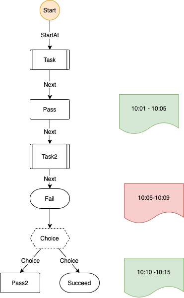

# Proof of Violation (i.e. availability)

Problem: How to verify _availability_ of services?

Solution: Proof of Violaitons



## Postgresfunc

It uses three concepts:

1. [Trigger functions](https://www.postgresql.org/docs/9.4/functions-trigger.html)
   which listen for any INSERT, UPDATE or DELETE commands on specified tables
2. [Notify](https://www.postgresql.org/docs/9.1/sql-notify.html) which is a
   simple postgres "publish" (the pub part of pubsub)
3. [Listen](https://www.postgresql.org/docs/9.1/sql-listen.html) which is a
   simple postgres "subscribe" (the sub part of pubsub)

```sql
-- Trigger notification for messaging to PG Notify
CREATE FUNCTION notify_trigger() RETURNS trigger AS $trigger$
DECLARE
  rec RECORD;
  payload TEXT;
  column_name TEXT;
  column_value TEXT;
  payload_items TEXT[];
BEGIN
  -- Set record row depending on operation
  CASE TG_OP
  WHEN 'INSERT', 'UPDATE' THEN
    rec := NEW;
  WHEN 'DELETE' THEN
    rec := OLD;
  ELSE
    RAISE EXCEPTION 'Unknown TG_OP: "%". Should not occur!', TG_OP;
  END CASE;

  -- Get required fields
  FOREACH column_name IN ARRAY TG_ARGV LOOP
    EXECUTE format('SELECT $1.%I::TEXT', column_name)
    INTO column_value
    USING rec;
    payload_items := array_append(payload_items, '"' || replace(column_name, '"', '\"') || '":"' || replace(column_value, '"', '\"') || '"');
  END LOOP;

  -- Build the payload
  payload := ''
    || '{'
    || '"timestamp":"' || CURRENT_TIMESTAMP                    || '",'
    || '"operation":"' || TG_OP                                || '",'
    || '"schema":"'    || TG_TABLE_SCHEMA                      || '",'
    || '"table":"'     || TG_TABLE_NAME                        || '",'
    || '"data":{'      || array_to_string(payload_items, ',')  || '}'
    || '}';

  -- Notify the channel
  PERFORM pg_notify('db_notifications', payload);

  RETURN rec;
END;
$trigger$ LANGUAGE plpgsql;

-- trigger
CREATE TRIGGER inputs_notify AFTER INSERT OR UPDATE OR DELETE ON inputs
FOR EACH ROW EXECUTE PROCEDURE notify_trigger(
  'id',
  'input_id',
  'value'
);
```

You can see the notify event happening on this line:
`PERFORM pg_notify('db_notifications', payload);`

Then in the [server](server/server.js), you can see the `LISTEN` command and the
`.on('notification', ...)` event:

```javascript
client.on("notification", function (msg) {
  const payload = msg.payload;
  console.log(payload);

  // Send payload into a queue etc...
  emitter.emit("event", payload);
});

// Listen for NOTIFY calls
(async () => {
  var res = await client.query("LISTEN db_notifications");
})();
```

There's then a simple event listener that sends the payload down to the
connected client, if the id matches some id requested by the client:

```javascript
emitter.on("event", function listener(payload) {
  if (payload["input_id"] === id) {
    ws.send(payload);
  }
});
```
